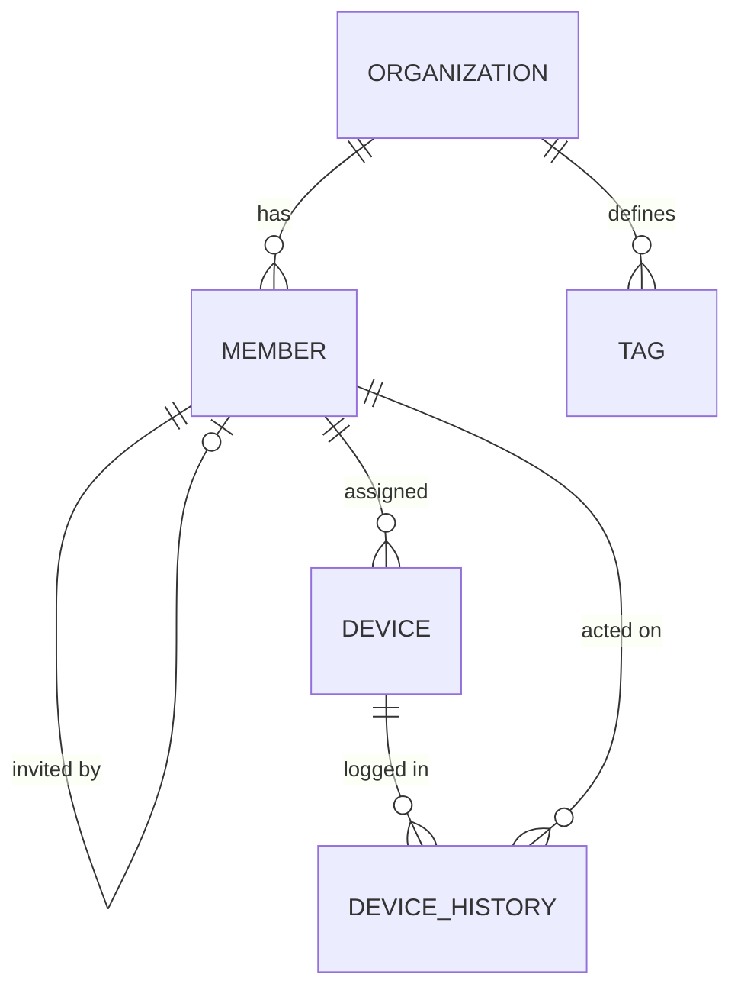

# Treasure 💻

```
████████╗██████╗ ███████╗ █████╗ ███████╗██╗   ██╗██████╗ ███████╗    
╚══██╔══╝██╔══██╗██╔════╝██╔══██╗██╔════╝██║   ██║██╔══██╗██╔════╝    
   ██║   ██████╔╝█████╗  ███████║███████╗██║   ██║██████╔╝█████╗      
   ██║   ██╔══██╗██╔══╝  ██╔══██║╚════██║██║   ██║██╔══██╗██╔══╝      
   ██║   ██║  ██║███████╗██║  ██║███████║╚██████╔╝██║  ██║███████╗    
   ╚═╝   ╚═╝  ╚═╝╚══════╝╚═╝  ╚═╝╚══════╝ ╚═════╝ ╚═╝  ╚═╝╚══════╝  
```

**Device management for organizations.**

Track hardware inventory, assign devices to members, and keep an audit trail of who
changed what and when.

---

## Features ✨

- **Inventory** — devices with detailed specs: model, CPU, RAM, storage, serial number, age, location, damage notes
- **Assignment** — assign a device to a member; status and pickup time update accordingly. Bulk assign, unassign and delete supported
- **History** — every change is recorded with field name, old value, new value, actor and timestamp
- **Search & filters** — filter the device list by field
- **Soft delete** — devices are hidden via a `visible` flag instead of being wiped
- **Members & organizations** — members are scoped to an organization and linked to their Keycloak identity, with invite tracking. Super admins can switch organizations
- **Dashboard** — landing page with an overview

---

## Tech Stack 🛠️

| Layer | Choice |
|---|---|
| Language | Java 21 |
| Framework | Quarkus 3.31.2 |
| Web / UI | Renarde 3.1.5 (server-side rendering with Qute) |
| Persistence | Hibernate ORM with Panache, repository pattern |
| Database | PostgreSQL, schema managed by Flyway |
| Auth | Keycloak via OIDC + Keycloak Admin REST Client |
| Storage | Amazon S3 (LocalStack in dev) |
| Extras | SmallRye OpenAPI, SmallRye Health, Mailer, Scheduler |
| Testing | JUnit 5, REST Assured, Mockito, WireMock, JaCoCo |

---

## Quick Start 🚀

**Prerequisites:** JDK 21 and Docker — Quarkus Dev Services provisions PostgreSQL,
Keycloak and LocalStack for you.

```shell
cd app.treasure.treasure-app
./mvnw quarkus:dev
```

The app comes up on <http://localhost:8080>. No manual database or Keycloak setup
needed; Flyway migrates the schema on boot.

### Dev credentials

| Username | Password | Organization | Roles |
|---|---|---|---|
| `admin` | `password` | Musikverein Harmonie | super_admin, admin, user |
| `maria` | `password` | Musikverein Harmonie | admin, user |
| `thomas` | `password` | Sportverein Alpenblick | user |

### Dev endpoints

| URL | What |
|---|---|
| <http://localhost:8080/q/dev/> | Quarkus Dev UI |
| <http://localhost:8080/q/swagger-ui> | Swagger UI |
| <http://localhost:8080/q/health> | Health checks |

---

## Data Model 🧩



A device belongs to a tenant indirectly, through the member it is assigned to.
Full column list: `src/main/resources/db/migration`.

---

## Project Structure 📁

```
app.treasure.treasure-app/
└── src/main/java/app/treasure/
    ├── dashboard/     landing page
    ├── device/        api · domain · filter · repository
    ├── member/        member administration
    ├── organization/  tenant management
    └── shared/        cross-feature code (tags, templates, utils)
```

Packages are organized by feature, not by layer. Inside a feature: `api/` controllers,
`domain/` entities, `model/` DTOs, `repository/` data access, `service/` business logic.

Migrations live in `src/main/resources/db/migration` — never edit an applied migration,
always add a new versioned file.

### Device routes

All under `/devices`, authentication required:

| Method | Path | What |
|---|---|---|
| `GET` | `/devices` | list |
| `GET` | `/devices/new` | create form |
| `GET` | `/devices/{id}/edit` | edit form |
| `POST` | `/devices/create` | create |
| `POST` | `/devices/{id}/update` | update |
| `POST` | `/devices/{id}/search` | filter |
| `POST` | `/devices/{id}/assign`, `/devices/{id}/delete` | single-device actions |
| `POST` | `/devices/assign-many`, `/unassign-many`, `/delete-many` | bulk actions |

---

## Development 🧑‍💻

```shell
./mvnw quarkus:dev              # dev mode with live reload
./mvnw test                     # run tests
./mvnw test -Dtest=ClassName    # run a single test class
./mvnw formatter:format         # apply formatting
./mvnw package                  # build target/quarkus-app/quarkus-run.jar
```

**House rules** — see [CONTRIBUTING.md](CONTRIBUTING.md):

- Branches: `feature/`, `fix/`, `refactor/`, `docs/`
- Commits and PR titles use Gitmoji: `✨ (device): Add assignment filter`
- Format before pushing, keep tests green, rebase on `main`
- SLF4J instead of `System.out.println`, constructor injection, records for DTOs
- CSS variables like `var(--treasure-primary)`, no hardcoded colors

---

## Troubleshooting 🔧

**`Failed to start quarkus`** — usually port 8080 is still held by an older run:

```shell
sudo ss -ltnp | grep ':8080'
sudo kill <pid>
```

Repeat until `ss` returns nothing, then start again.

**Dev Services misbehaving** — check that the Docker daemon is up and no stale Keycloak
/ PostgreSQL / LocalStack containers are left over (`docker ps`, then `docker rm -f <id>`).

---

## Requirements 📋

<details>
<summary>Original project scope</summary>

**Functional**

- Users can see a list of all devices and their current status
- Users can add a new device by filling out a simple form
- Users can edit device details like name and pickup time
- Users can delete a device that is no longer needed
- When a device is assigned to someone it automatically becomes unavailable, when returned it becomes available again
- Users can see who has a device and when they are picking it up

**Non-Functional**

- The app is built with Java and runs as a web application
- All data is saved to a database so nothing is lost on restart
- The interface should be clean and easy to use
- The app should be easy to set up and run locally

**User Stories**

- As a user, I want to see a list of all devices so that I know what is available and what is not
- As a user, I want to add a new device so that it can be tracked in the system
- As a user, I want to edit a device so that I can update its information if something changes
- As a user, I want to delete a device so that the list stays clean and up to date
- As a user, I want to see who has booked a device so that I know who is responsible for it
- As a user, I want the device status to update automatically so that I don't have to do it manually
- As a user, I want to see the pickup time of a device so that I know when it will be returned

</details>
